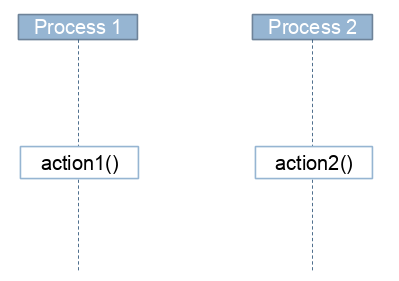
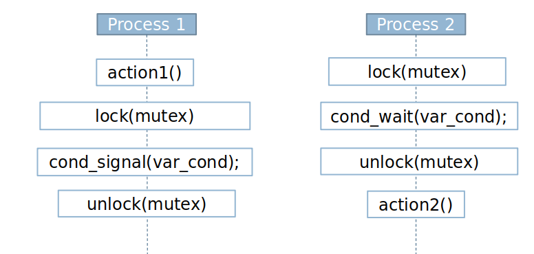
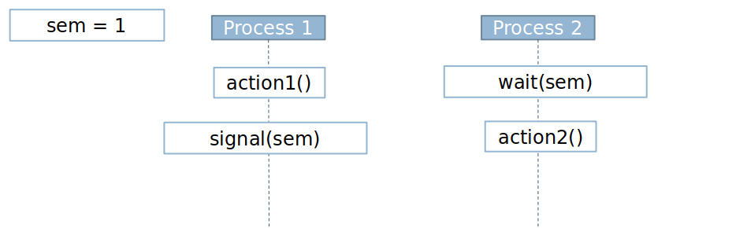
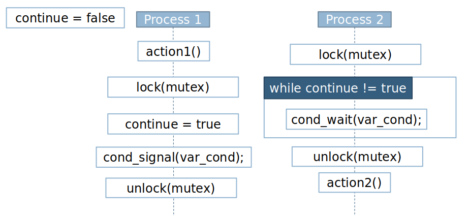
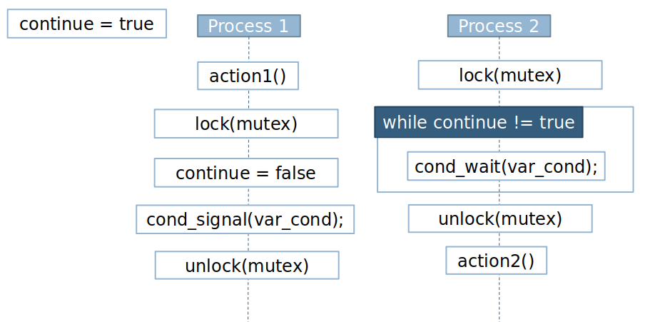
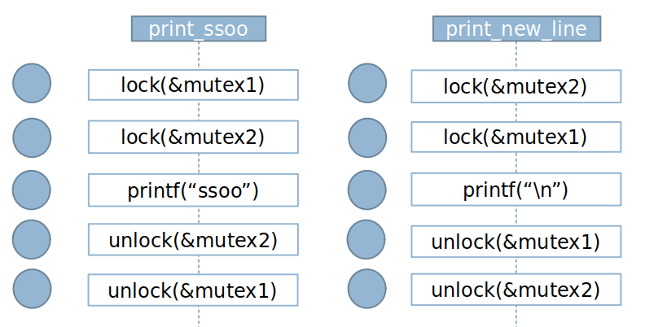
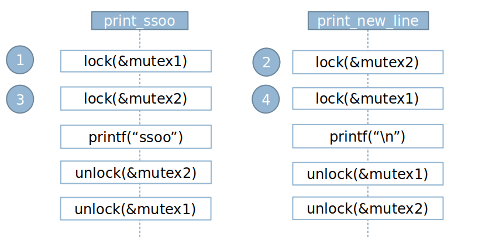

# Lab 10 Introduction to concurrency

## Goals

Work with basic concepts of concurrency and synchronization mechanisms:

- Semaphores
- Mutexes

## Statements

###  Exercise 01

Given the following sequence diagram:



Which of the following implementations ensures that action1 () always executes before action2 ()


#### 1.1 Solution. Option A


#### 1.2 Solution. Option B


#### 1.3 Solution. Option C


#### 1.4 Solution. Option D


###  Exercise 02

What execution secuence will create a deadlock?

```
#include <stdio.h>
#include <stdlib.h>
#include <string.h>
#include <pthread.h>
#include <unistd.h>

pthread_mutex_t mutex1 = PTHREAD_MUTEX_INITIALIZER;
pthread_mutex_t mutex2 = PTHREAD_MUTEX_INITIALIZER;

void* print_ssoo(void *ptr);

void* print_new_line(void *ptr);

int main() {

    pthread_t t1, t2;
    
    pthread_create(&t1, NULL, print_ssoo, NULL);
    pthread_create(&t2, NULL, print_new_line, NULL);
    
    pthread_join(t1,NULL);
    pthread_join(t2,NULL);
}

void* print_ssoo(void *ptr) {

    pthread_mutex_lock(&mutex1);
    pthread_mutex_lock(&mutex2);
    
    printf("SSOO");
    
    pthread_mutex_unlock(&mutex2);
    pthread_mutex_unlock(&mutex1);
    
    pthread_exit(0);

}

void* print_new_line(void *ptr) {

    pthread_mutex_lock(&mutex2);
    pthread_mutex_lock(&mutex1);
    
    printf("\n");
    
    pthread_mutex_unlock(&mutex1);
    pthread_mutex_unlock(&mutex2);
    
    pthread_exit(0);
}
```
#### 2 Solution. 




###  Exercise 03

Given the following schema:
| Process P1  	|   Process P2	| 
|---		|---		|	
| ...	  	|   ...	| 
|   action1()	|   action2()	| 
		
Assure that action1() always executes before action2(), using:
- semaphores.
- Mutex y conditional variables.

#### 3.1 Solution with semaphores. Option A

| Process P1  	|   Process P2	|	
|---		|---		|	
| ...	  	|   ...	| 
|   action1()	|   wait(s)	| 
|   signal(s)	|   action2()	| 

#### 3.1 Solution with mutex. Option B

| Process P1  			|   Process P2				|	
|---				|	---				|	
| ...	  			|   ...				| 
|   action1();			|  lock (mutex);			| 
|   lock(mutex);		|  while(continue != true) {		| 
|   continue = true;		|   	cond_wait(mutex, var_cond);	| 
|   cond_signal(var_cond);	|   }					| 
|   unlock (mutex);		|  action2();				| 

###  Exercise 04

Create a program that creates 2 ”siesta" threads, leaving 2 seconds between the first and the second. The first must always be executed before the second. 

The function of “siesta” thread is to sleep 4 seconds.

###  Exercise 05

Analyze the following program and say what the value of "total_amount" will be. If there is any problem, fix it with semaphores.

```
/* compile as "gcc -pthread -o main.c main" */
/* execute as "taskset 0x01 main" to run on a single processor */

#include <stdio.h>
#include <pthread.h>
#define NUMBER_ADDED 10000
#define NUMBER_TIMES 10000

/** 
* Global variable with the accumulated value where the sum is made.
* Acts as a shared variable between the two threads.
*/
long total_amount = 0;

/**
* function that returns accumulator + n. Makes the
* sum one by one with a for loop.
*/
long addN(long accumulator, int n) {
    int i;
    long total = accumulator;
    
    for (i=0;i<n;i++){
       total += 1;
    }
    
    return total;
}

/**
* The function to be executed through a thread. Call
* NUMBER_TIMES addN function to add NUMBER_ADDED to the total_amount variable.
*/
void run() {
    int i;
    
    for (i=0;i<= NUMBER_TIMES;i++){
        total_amount = addN (total_amount, NUMBER_ADDED);
    }
   
}

/* Main program. Runs simultaneously on two different threads.
    Wait for both to finish and look at the final summed value, 
    checking if it is the expected.
*/
     
int main() {
    
    pthread_t th1, th2;
    long expected_result;
        
    // we create  2 threads
    pthread_create(&th1,NULL,(void*)run, NULL);
    pthread_create(&th2,NULL,(void*)run, NULL);

    pthread_join(th1, NULL);
    pthread_join(th2, NULL);

    expected_result = NUMBER_ADDED * NUMBER_TIMES * 2;
   
    printf("The final result is %ld\n" ,total_amount);
    printf("We expected %ld\n" , expected_result);

        if (total_amount != expected_result)
            printf("DO NOT MATCH!!!");
} 
```

###  Exercise 06

The following code implements an application with two threads: one prints the even numbers on the screen and the other prints the odd numbers on the screen.

```
#include <unistd.h>
#include <stdio.h>
#include <stdlib.h>
#include <pthread.h>
#include <sys/types.h>
#include <sys/stat.h>
#include <fcntl.h>

const int MAX_NUMBER = 200;
int shared_data = 0;


enum numbers {EVEN, ODD};


void *oddThread(void *arg) {
   int counter=1;

   while (counter <=MAX_NUMBER){
      printf ("thOdd:%d\n", shared_data++);
      counter=counter+2;

   }
   pthread_exit(0);
}

void *evenThread(void *arg) {
   int counter=2;

   while (counter <=MAX_NUMBER){
      printf ("thEven:%d\n", shared_data++);
      counter=counter+2;


  }
   pthread_exit(0);
}

int main(){
    int i;
    pthread_t idth[2];


    pthread_create(&idth[0],NULL,oddThread,NULL);
    pthread_create(&idth[1],NULL,evenThread,NULL);
	
    // I wait for the completion of the thread
    for (i=0; i<2; i++) 
      pthread_join(idth[i],NULL);


    return(0);
}

```

We want the execution to provide the following output on screen:

```
EvenThread = 0
OddThread = 1
EvenThread = 2
OddThread = 3
EvenThread = 4
OddThread = 5
EvenThread = 6

.....

```
A first execution of the code has been carried out and the following appears:

```
OddThread = 0
OddThread = 2
OddThread = 3
OddThread = 4
EvenThread = 5
EvenThread = 6

.....

```
It is requested to resolve the following sections:

1. Indicate what problems are generated by using a shared variable to send the data to print from the even thread to the odd thread.

2. Implement a version of the previous program that solves the previous problems using some of the concurrency management techniques.


###  Exercise 07

Implement a program that solves the producer-consumer problem with MUTEX. 
The program executes N producers threads and M consumer threads, that share a finite size buffer. The producers's task is to generate a random number between 1 to 100 and  store it, and start over; while the consumers takes (simultaneously) numbers one to one. 

The problem is that the producers does not add more numbers than the buffer capacity and that the consumers does not try to take a number if the buffer is empty.
